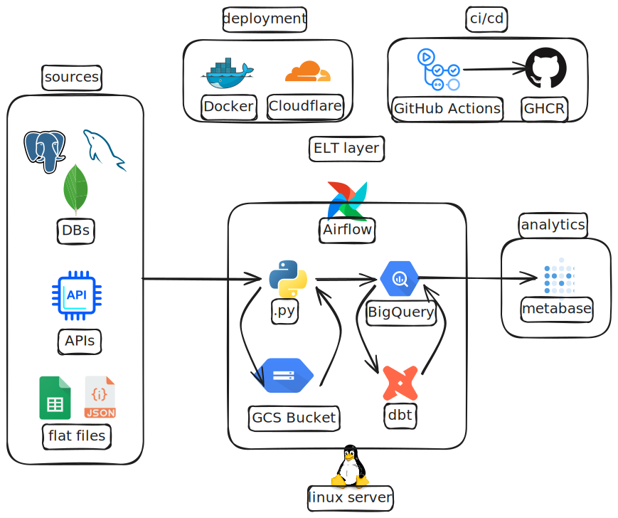

# data-platform

`data-platform` is a loosely coupled monorepo for data platform runtime and
pipeline code.

The repository is organized by component:

```text
data-platform/
|-- scripts/   # extract/load commands and source-specific pipeline code
|-- dbt/       # warehouse transformations, tests, and dbt project configuration
|-- airflow/   # orchestration runtime and DAGs
|-- metabase/  # analytics service runtime/configuration
`-- deploy/    # shared environment bootstrap and deployment documentation
```

Each component is developed as an independent project with its own README,
dependencies, tests, and runtime contract. Components interact through Docker
images, APIs, warehouse tables, or documented artifacts rather than relative
imports or production runtime bind mounts.

## Outline

- [Production-Scale Assumption](#production-scale-assumption)
- [Initial Delivery Direction](#initial-delivery-direction)
- [Environments](#environments)
- [Deployed Interfaces](#deployed-interfaces)
- [Setup Flow](#setup-flow)
- [Images](#images)
- [CI/CD](#cicd)
- [Public Readiness Gate](#public-readiness-gate)

## Production-Scale Assumption

Design decisions in this repository assume a production data engineering
environment: hundreds of Airflow DAGs, thousands of dbt models, large warehouse
tables, multiple data sources, bounded CI/CD, and operational ownership by a
functional data engineering team.

The first pipeline can be small, but the platform architecture is not reduced
to one-pipeline assumptions. MVP shortcuts are acceptable only when they keep
the core workflow moving and are documented as temporary.



## Initial Delivery Direction

The platform is developed vertically so each boundary is validated before the
next component depends on it:

1. scripts source extraction and raw loading
2. dbt transformations and tests
3. scripts and dbt runtime images
4. Airflow orchestration
5. CI for implemented components
6. QA and prod deployment paths
7. analytics service integration

## Environments

The platform promotes changes through:

```text
dev -> QA -> prod
```

Environment-specific secrets and `.env` files are not committed. A development
workstation defaults to `$HOME/dev/secrets/data-platform/.env`; the path remains
configurable through `DATA_PLATFORM_SECRETS_DIR` or
`DATA_PLATFORM_ENV_FILE`. QA and prod configuration belongs on the matching
deployment platform or authorized administration host, not on a development
workstation. Local dev uses component-specific service-account JSON files stored
under the external secrets directory and local image tags. Deployed QA/prod use
immutable registry image tags, environment-specific service-account JSON files
stored on the deployment platform, and no runtime source-code bind mounts.

## Deployed Interfaces

Deployed web interfaces are exposed through Cloudflare Tunnel hostnames when
they are ready for external access. The canonical endpoint inventory and access
posture live in [deploy/README.md](deploy/README.md) so public exposure
decisions stay in the deployment runbook rather than being duplicated across
component READMEs.

| Surface | Hostname |
| --- | --- |
| Airflow | [airflow.kevinesg.com](https://airflow.kevinesg.com) |
| Metabase | [metabase.kevinesg.com](https://metabase.kevinesg.com) |
| dbt docs | [dbt.kevinesg.com](https://dbt.kevinesg.com) |
| Elementary Data Reliability docs | [edr.kevinesg.com](https://edr.kevinesg.com) |

## Setup Flow

Start here before running component commands. The root README explains the
repository boundaries and the order of setup documents; detailed commands live
in the owning README so each command sequence has one canonical home.

1. Read this README for repository boundaries, environment promotion, and
   production-scale assumptions.
2. Read [deploy/README.md](deploy/README.md) for workstation tools, CLI
   authentication, shared dev project topology, and platform bootstrap rules.
3. Run [deploy/README.md](deploy/README.md) **Platform Bootstrap** only when
   creating or repairing shared project resources. Team members joining an
   existing dev environment skip platform bootstrap after receiving their
   assigned component workspace values.
4. Run the relevant component README end to end:
   - [scripts/README.md](scripts/README.md) for extract/load service account,
     landing bucket, raw dataset, local credentials, runtime setup, and scripts
     verification.
   - [dbt/README.md](dbt/README.md) for dbt project setup, dbt service account,
     datasets, external profile, local credentials, and `dbt debug`.
   - [airflow/README.md](airflow/README.md) for the local Airflow runtime and
     empty-stack validation.
   - [metabase/README.md](metabase/README.md) for the analytics service
     runtime, application database, and BigQuery connection setup.
5. Run source-specific or domain-specific docs only after the owning component
   setup passes. For example, scripts pipeline commands live under
   [scripts/pipelines/](scripts/pipelines/).
6. Validate changes against dev first, then QA, then prod. Do not run
   cloud-connected commands until the matching documented prerequisites are
   complete.

## Images

Runtime components are packaged as Docker images. Local development uses short
local tags:

```text
data-platform-scripts:dev
data-platform-dbt:dev
data-platform-airflow:dev
```

Registry images use GitHub Container Registry names:

```text
ghcr.io/kevinesg/data-platform-scripts
ghcr.io/kevinesg/data-platform-dbt
ghcr.io/kevinesg/data-platform-airflow
```

Published registry images use immutable commit tags:

```text
ghcr.io/kevinesg/data-platform-scripts:sha-<commit-sha>
ghcr.io/kevinesg/data-platform-dbt:sha-<commit-sha>
ghcr.io/kevinesg/data-platform-airflow:sha-<commit-sha>
```

Metabase uses an official pinned `metabase/metabase` image configured through
its own external `metabase.env` file instead of a repository-built image.

## CI/CD

Component CI runs only for changed component paths and does not use live cloud
credentials. Pull-request checks validate code, configuration parsing, and
Docker image builds without publishing images or querying GCP resources.

Current workflows:

- `scripts-ci`: installs the locked scripts runtime, runs lint/tests, compiles
  Python files, and builds the scripts image.
- `dbt-ci`: installs the locked dbt runtime, parses the dbt project with a
  non-secret profile, and builds the dbt image.
- `airflow-ci`: builds the Airflow image and imports packaged DAG files with
  dummy non-secret environment values.
- `publish-images`: publishes immutable GHCR image tags after the matching
  component CI workflow succeeds on `main`, or through manual dispatch.
- `deploy-qa`: deploys the selected Git ref to the QA host with the latest
  matching immutable runtime images.
- `deploy-prod`: promotes the QA image manifest to prod after GitHub
  environment approval and deployed smoke checks.

Workflow syntax, local validation options, and CI/CD boundaries are documented
in [.github/workflows/README.md](.github/workflows/README.md).

## Public Readiness Gate

Before making the repository public, complete a review pass that treats docs,
metadata, examples, generated files, and Git history as publishable surfaces.

Required checks:

- Confirm the working tree and index contain only intentional public files.
- Confirm `AGENTS.md`, local `docs/`, `data-platform-archive/`, local snapshots,
  `.env` files, service-account keys, credentials, generated artifacts,
  backups, warehouse exports, and runtime logs are not staged.
- Run a current-tree secret scan and a full-history secret scan with an approved
  scanner. Keep scan outputs outside the repository unless they are sanitized.
- Review README and component docs for private host paths, credentials, project
  internals, personal finance details, incident details, and sensitive metadata.
- Review generated dbt docs and Elementary Data Reliability output before
  exposing static sites publicly.
- Re-check external hostnames and public access posture in
  [deploy/README.md](deploy/README.md).

Do not make the repository public until the current tree, history, and generated
documentation surfaces have all passed review.
