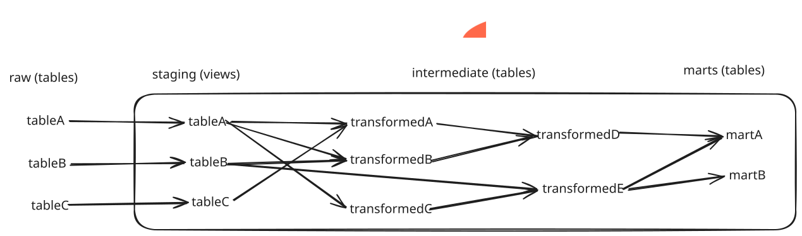

# dbt

The `dbt` component owns warehouse transformations, tests, and dbt project
configuration.

Transformation logic belongs here instead of Airflow or extract/load scripts.
Targets, schemas, and model organization are designed for production-scale
growth across many domains and thousands of models.

Pipeline-specific model behavior lives near the relevant dbt models, tests, or
domain docs instead of accumulating in this component README.

## Outline

- [Command Flow](#command-flow)
- [Project Layout](#project-layout)
- [Local Runtime Setup](#local-runtime-setup)
- [Existing-Checkout Setup](#existing-checkout-setup)
- [Profile Contract](#profile-contract)
- [End-To-End Dev Setup](#end-to-end-dev-setup)
  - [dbt Cloud Workspace](#dbt-cloud-workspace)
  - [dbt Local Workstation](#dbt-local-workstation)
- [Docker Runtime](#docker-runtime)

## Command Flow

Use this README after reading the root [README.md](../README.md) and completing
the applicable shared setup in [deploy/README.md](../deploy/README.md). For an
existing dev environment, that usually means workstation tools are installed and
the platform maintainer has provided the dbt workspace values.

Follow this file in order for dbt component setup:

1. **Local Runtime Setup** verifies the dbt CLI can run from this component.
2. **Existing-Checkout Setup** installs the locked runtime for both projects.
3. **dbt Cloud Workspace** provisions or repairs the dbt service account, raw
   read grant, and dbt target datasets.
4. **dbt Local Workstation** creates the external service-account key and
   environment file, configures the external dbt profile, and runs `dbt debug`.
5. **dbt Docker Runtime** builds the dbt image and validates dbt commands inside
   the container with credentials mounted at runtime.

## Project Layout

The component contains two domain-owned projects that run independently while
sharing one locked Python runtime and one environment-driven profile template:

```text
dbt/
  personal_finance/
  wremotely/
  profiles.yml.example
```

Both projects currently target BigQuery. Personal finance remains on BigQuery;
future wremotely warehouse work belongs inside `dbt/wremotely` and must not add
a dependency on the personal-finance graph.



Each project owns its sources, models, seeds, tests, analyses, snapshots,
macros, and `dbt_project.yml`. Cross-project `ref` and `source` dependencies are
not allowed.

## Local Runtime Setup

Check for `uv` before working in this component. Install it only when the
command is missing on the workstation.

```bash
if command -v uv >/dev/null; then
  uv --version
else
  curl -LsSf https://astral.sh/uv/install.sh | sh
  uv --version
fi
```

Install from the committed lockfile:

```bash
cd dbt
uv sync --locked
```

Run `uv lock` only in a dependency-change commit where `pyproject.toml` is
intentionally updated.

Run the first local verification from the component directory:

```bash
cd dbt

uv run dbt --version
```

## Existing-Checkout Setup

Set up the local runtime from the lockfile and verify the CLI:

```bash
cd dbt
uv sync --locked
uv run dbt --version
```

After this local runtime check passes, continue with **End-To-End Dev Setup**
below for the dbt service account, datasets, external environment file,
service-account key, profile file, and `dbt debug`.

## Profile Contract

The committed `profiles.yml.example` is a non-secret template containing the
`personal_finance` and `wremotely` profiles.
The working `profiles.yml` lives outside the repository with the rest of the
project's local dev configuration.

Local dbt development uses the dbt service-account JSON file configured through
`DBT_GOOGLE_APPLICATION_CREDENTIALS`.

The committed profile defines `dev`, `qa`, and `prod` targets. Local dev uses
`DBT_TARGET=dev`; deployed environments set `DBT_TARGET` to their environment
name and use the profile embedded in the published dbt image.

BigQuery job creation waits default to 60 seconds and query execution waits
default to 300 seconds. The locked dbt-bigquery 1.12 runtime submits each query
with a stable job ID and attaches to that existing job when a repeated
submission receives `409 Already Exists`, so a lost creation acknowledgement
does not duplicate or abandon the accepted query. A caller may set
`DBT_JOB_CREATION_TIMEOUT_SECONDS` and `DBT_JOB_EXECUTION_TIMEOUT_SECONDS` to
positive integers when one bounded workload needs larger waits. The wremotely
serving DAG owns those overrides and passes 60 seconds for job creation and
900 seconds for execution from its Airflow environment; these adapter settings
do not replace the DAG task's separate total execution timeout.

## End-To-End Dev Setup

This section sets up the dbt component from workspace provisioning through
local `dbt debug`. Platform project creation, billing, shared service
enablement, and workstation tool installation are covered by
[deploy/README.md](../deploy/README.md).

The service check in this section keeps the component runbook self-contained.
In an already configured dev project, it reports that the required services are
enabled. If a required service is missing, only a platform maintainer applies
the mutating enable command.

Run commands from the repository root unless a block changes directories.

### dbt Cloud Workspace

Run this subsection as a platform maintainer.

Every time this subsection is resumed from the middle, rerun the first block
below before running a resource block. The resource blocks create datasets and
grant IAM, so they run from the authenticated platform-maintainer configuration.
The dbt service account intentionally cannot grant access to itself.

```bash
export PROJECT_ID=kevinesg-dev
export BIGQUERY_LOCATION=US
export DEVELOPER_ID=kevinesg
export DEVELOPER_EMAIL=kevinesg.dev@gmail.com
export RAW_DATASET="raw_${DEVELOPER_ID}"
export DBT_DATASET="dbt_${DEVELOPER_ID}"
export DBT_STAGING_DATASET="${DBT_DATASET}_staging"
export DBT_INTERMEDIATE_DATASET="${DBT_DATASET}_intermediate"
export DBT_WRITE_DATASETS="$DBT_INTERMEDIATE_DATASET"
export DBT_SERVICE_ACCOUNT_NAME="data-platform-dbt-${DEVELOPER_ID}"
export DBT_SERVICE_ACCOUNT_EMAIL="${DBT_SERVICE_ACCOUNT_NAME}@${PROJECT_ID}.iam.gserviceaccount.com"
export PLATFORM_BOOTSTRAP_CONFIGURATION=data-platform-bootstrap-dev

gcloud config configurations activate "$PLATFORM_BOOTSTRAP_CONFIGURATION"
gcloud config set project "$PROJECT_ID"
gcloud config list
```

`DEVELOPER_ID` is a stable lowercase identifier containing 3-8 letters or
digits.

Verify or enable the shared services needed by dbt:

```bash
enable_missing_dbt_services() {
  local required_dbt_services=(
    bigquery.googleapis.com
    iam.googleapis.com
    serviceusage.googleapis.com
  )
  local enabled_dbt_services
  local missing_dbt_services=()

  enabled_dbt_services="$(
    gcloud services list \
      --enabled \
      --project="$PROJECT_ID" \
      --format='value(config.name)'
  )" || return 1

  for required_service in "${required_dbt_services[@]}"; do
    if ! printf '%s\n' "$enabled_dbt_services" |
      grep -Fxq "$required_service"; then
      missing_dbt_services+=("$required_service")
    fi
  done

  if ((${#missing_dbt_services[@]})); then
    gcloud services enable \
      "${missing_dbt_services[@]}" \
      --project="$PROJECT_ID"
  else
    echo "All required dbt services are enabled."
  fi
}

enable_missing_dbt_services
```

Create or verify the dbt service account:

```bash
if gcloud iam service-accounts describe \
  "$DBT_SERVICE_ACCOUNT_EMAIL" \
  --project="$PROJECT_ID" >/dev/null 2>&1; then
  echo "Service account already exists: $DBT_SERVICE_ACCOUNT_EMAIL"
else
  gcloud iam service-accounts create "$DBT_SERVICE_ACCOUNT_NAME" \
    --project="$PROJECT_ID" \
    --display-name="Data Platform dbt Dev ${DEVELOPER_ID}"
fi

gcloud projects add-iam-policy-binding "$PROJECT_ID" \
  --member="serviceAccount:$DBT_SERVICE_ACCOUNT_EMAIL" \
  --role="roles/bigquery.user"
```

The dbt BigQuery adapter creates or ensures target schemas during `dbt run`.
`roles/bigquery.jobUser` can run query jobs but does not include
`bigquery.datasets.create`; `roles/bigquery.user` is the predefined project role
needed for local dbt runs. Dataset-level grants below still define which raw and
dbt datasets the service account can read or write.

Create or verify the raw dataset boundary used by dbt sources:

```bash
if bq show \
  --project_id="$PROJECT_ID" \
  "$PROJECT_ID:$RAW_DATASET"; then
  echo "Raw dataset already exists: $PROJECT_ID:$RAW_DATASET"
else
  echo "Create the raw dataset only when the bq show output says Not found."
  read -r -p "Create raw dataset $PROJECT_ID:$RAW_DATASET? [y/N] " CREATE_RAW_DATASET
  if test "$CREATE_RAW_DATASET" = y; then
    bq --location="$BIGQUERY_LOCATION" mk \
      --dataset \
      "$PROJECT_ID:$RAW_DATASET"
  fi
fi

bq query \
  --project_id="$PROJECT_ID" \
  --location="$BIGQUERY_LOCATION" \
  --use_legacy_sql=false \
  "GRANT \`roles/bigquery.dataViewer\`
   ON SCHEMA \`$PROJECT_ID\`.$RAW_DATASET
   TO \"serviceAccount:$DBT_SERVICE_ACCOUNT_EMAIL\""

bq show \
  --project_id="$PROJECT_ID" \
  "$PROJECT_ID:$RAW_DATASET"
```

Create or verify the dbt target dataset:

```bash
if bq show \
  --project_id="$PROJECT_ID" \
  "$PROJECT_ID:$DBT_DATASET"; then
  echo "dbt target dataset already exists: $PROJECT_ID:$DBT_DATASET"
else
  echo "Create the dbt target dataset only when the bq show output says Not found."
  read -r -p "Create dbt target dataset $PROJECT_ID:$DBT_DATASET? [y/N] " CREATE_DBT_DATASET
  if test "$CREATE_DBT_DATASET" = y; then
    bq --location="$BIGQUERY_LOCATION" mk \
      --dataset \
      "$PROJECT_ID:$DBT_DATASET"
  fi
fi

bq query \
  --project_id="$PROJECT_ID" \
  --location="$BIGQUERY_LOCATION" \
  --use_legacy_sql=false \
  "GRANT \`roles/bigquery.dataEditor\`
   ON SCHEMA \`$PROJECT_ID\`.$DBT_DATASET
   TO \"serviceAccount:$DBT_SERVICE_ACCOUNT_EMAIL\""

bq show \
  --project_id="$PROJECT_ID" \
  "$PROJECT_ID:$DBT_DATASET"
```

Create or verify the dbt staging dataset:

This block is a platform-maintainer resource block. It must run from the
authenticated bootstrap configuration.

```bash
if bq show \
  --project_id="$PROJECT_ID" \
  "$PROJECT_ID:$DBT_STAGING_DATASET"; then
  echo "dbt staging dataset already exists: $PROJECT_ID:$DBT_STAGING_DATASET"
else
  echo "Create the dbt staging dataset only when the bq show output says Not found."
  read -r -p "Create dbt staging dataset $PROJECT_ID:$DBT_STAGING_DATASET? [y/N] " CREATE_DBT_STAGING_DATASET
  if test "$CREATE_DBT_STAGING_DATASET" = y; then
    bq --location="$BIGQUERY_LOCATION" mk \
      --dataset \
      "$PROJECT_ID:$DBT_STAGING_DATASET"
  fi
fi

bq query \
  --project_id="$PROJECT_ID" \
  --location="$BIGQUERY_LOCATION" \
  --use_legacy_sql=false \
  "GRANT \`roles/bigquery.dataEditor\`
   ON SCHEMA \`$PROJECT_ID\`.$DBT_STAGING_DATASET
   TO \"serviceAccount:$DBT_SERVICE_ACCOUNT_EMAIL\""

bq show \
  --project_id="$PROJECT_ID" \
  "$PROJECT_ID:$DBT_STAGING_DATASET"
```

dbt creates BigQuery datasets from the target dataset plus a model layer suffix.
The staging models use `+schema: staging`, so the default BigQuery dataset name
is `dbt_<developer>_staging`.

Create or verify additional dbt write datasets needed by the selected model or
domain work:

This block is a platform-maintainer resource block. It must run from the
authenticated bootstrap configuration.

```bash
for DBT_WRITE_DATASET in \
  $DBT_WRITE_DATASETS; do
  if bq show \
    --project_id="$PROJECT_ID" \
    "$PROJECT_ID:$DBT_WRITE_DATASET"; then
    echo "dbt write dataset already exists: $PROJECT_ID:$DBT_WRITE_DATASET"
  else
    echo "Create the dbt write dataset only when the bq show output says Not found."
    read -r -p "Create dbt write dataset $PROJECT_ID:$DBT_WRITE_DATASET? [y/N] " CREATE_DBT_WRITE_DATASET
    if test "$CREATE_DBT_WRITE_DATASET" = y; then
      bq --location="$BIGQUERY_LOCATION" mk \
        --dataset \
        "$PROJECT_ID:$DBT_WRITE_DATASET"
    fi
  fi

  bq query \
    --project_id="$PROJECT_ID" \
    --location="$BIGQUERY_LOCATION" \
    --use_legacy_sql=false \
    "GRANT \`roles/bigquery.dataEditor\`
     ON SCHEMA \`$PROJECT_ID\`.$DBT_WRITE_DATASET
     TO \"serviceAccount:$DBT_SERVICE_ACCOUNT_EMAIL\""

  bq show \
    --project_id="$PROJECT_ID" \
    "$PROJECT_ID:$DBT_WRITE_DATASET"
done
```

Intermediate models use `+schema: intermediate`, so the default BigQuery dataset
name is `dbt_<developer>_intermediate`. Domain-specific seeds and marts may use
additional custom schemas. Their owning model or domain docs should list the
dataset names to append to `DBT_WRITE_DATASETS`.

For deployed `qa` and `prod` targets, `generate_schema_name` uses exact custom
schema names instead of prefixing them with `DBT_DATASET`. For example,
`+schema: staging` builds in `staging`. Local dev keeps the default prefixed
schema behavior for developer isolation.

### dbt Local Workstation

Run this subsection on the development workstation.

```bash
export PROJECT_ID=kevinesg-dev
export BIGQUERY_LOCATION=US
export DEVELOPER_ID=kevinesg
export DEVELOPER_EMAIL=kevinesg.dev@gmail.com
export RAW_DATASET="raw_${DEVELOPER_ID}"
export DBT_DATASET="dbt_${DEVELOPER_ID}"
export DBT_STAGING_DATASET="${DBT_DATASET}_staging"
export DBT_INTERMEDIATE_DATASET="${DBT_DATASET}_intermediate"
export DBT_WRITE_DATASETS="$DBT_INTERMEDIATE_DATASET"
export DBT_SERVICE_ACCOUNT_NAME="data-platform-dbt-${DEVELOPER_ID}"
export DBT_SERVICE_ACCOUNT_EMAIL="${DBT_SERVICE_ACCOUNT_NAME}@${PROJECT_ID}.iam.gserviceaccount.com"
export DEVELOPER_CONFIGURATION="data-platform-dev-${DEVELOPER_ID}"
export DATA_PLATFORM_SECRETS_DIR="${DATA_PLATFORM_SECRETS_DIR:-$HOME/dev/secrets/data-platform}"
export DBT_GOOGLE_APPLICATION_CREDENTIALS="$DATA_PLATFORM_SECRETS_DIR/dbt-service-account.json"

if gcloud config configurations describe \
  "$DEVELOPER_CONFIGURATION" >/dev/null 2>&1; then
  gcloud config configurations activate "$DEVELOPER_CONFIGURATION"
else
  gcloud config configurations create "$DEVELOPER_CONFIGURATION"
fi

gcloud auth login "$DEVELOPER_EMAIL"
gcloud config set account "$DEVELOPER_EMAIL"
gcloud config set project "$PROJECT_ID"
gcloud config unset auth/impersonate_service_account
```

The unset command only clears legacy local CLI state from the previous
impersonated-ADC setup. dbt runtime authentication uses the JSON key configured
below.

Create or verify the external dev environment file:

```bash
export DATA_PLATFORM_SECRETS_DIR="${DATA_PLATFORM_SECRETS_DIR:-$HOME/dev/secrets/data-platform}"
export DATA_PLATFORM_ENV_FILE="${DATA_PLATFORM_ENV_FILE:-$DATA_PLATFORM_SECRETS_DIR/.env}"
export DATA_PLATFORM_ENV_PARENT="$(dirname "$DATA_PLATFORM_ENV_FILE")"

mkdir -p "$DATA_PLATFORM_ENV_PARENT"
chmod 700 "$DATA_PLATFORM_ENV_PARENT"

if test -f "$DATA_PLATFORM_ENV_FILE"; then
  echo "Environment file already exists: $DATA_PLATFORM_ENV_FILE"
else
  cp dbt/.env.example "$DATA_PLATFORM_ENV_FILE"
  chmod 600 "$DATA_PLATFORM_ENV_FILE"
fi
```

Create the dbt service-account key only when the external file does not already
exist:

```bash
if test -f "$DBT_GOOGLE_APPLICATION_CREDENTIALS"; then
  echo "dbt service-account key already exists."
else
  gcloud iam service-accounts keys create \
    "$DBT_GOOGLE_APPLICATION_CREDENTIALS" \
    --iam-account="$DBT_SERVICE_ACCOUNT_EMAIL" \
    --project="$PROJECT_ID"
  chmod 600 "$DBT_GOOGLE_APPLICATION_CREDENTIALS"
fi

test -s "$DBT_GOOGLE_APPLICATION_CREDENTIALS"
grep -Fq "$DBT_SERVICE_ACCOUNT_EMAIL" \
  "$DBT_GOOGLE_APPLICATION_CREDENTIALS"
```

The key is a long-lived credential. Keep it outside the repository and runtime
image, and delete/recreate it immediately if it is exposed.

Add or verify the dbt values in the external dev environment file. If another
component already created the file, keep the existing values and merge the dbt
values from `dbt/.env.example`.

```dotenv
PROJECT_ID=kevinesg-dev
RAW_DATASET=raw_kevinesg
DBT_TARGET=dev
DBT_DATASET=dbt_kevinesg
DBT_SERVICE_ACCOUNT_EMAIL=data-platform-dbt-kevinesg@kevinesg-dev.iam.gserviceaccount.com
DBT_GOOGLE_APPLICATION_CREDENTIALS=/home/kevinesg/dev/secrets/data-platform/dbt-service-account.json
DBT_THREADS=4
BIGQUERY_LOCATION=US
```

Install the local dbt runtime:

```bash
cd dbt
uv sync --locked
uv run dbt --version
```

Create or verify the external dbt profile:

```bash
export DATA_PLATFORM_SECRETS_DIR="${DATA_PLATFORM_SECRETS_DIR:-$HOME/dev/secrets/data-platform}"
export DATA_PLATFORM_DBT_PROFILES_DIR="${DATA_PLATFORM_DBT_PROFILES_DIR:-$DATA_PLATFORM_SECRETS_DIR/dbt}"
export DBT_PROFILES_DIR="${DBT_PROFILES_DIR:-$DATA_PLATFORM_DBT_PROFILES_DIR}"

mkdir -p "$DBT_PROFILES_DIR"
chmod 700 "$DBT_PROFILES_DIR"

cp profiles.yml.example "$DBT_PROFILES_DIR/profiles.yml"
chmod 600 "$DBT_PROFILES_DIR/profiles.yml"
```

The committed profile is environment-driven, so replacing the external copy is
the supported way to apply authentication contract changes.

Load the external environment file before running dbt commands:

```bash
set -a
. "$DATA_PLATFORM_ENV_FILE"
set +a
```

Verify the profile and connection:

```bash
gcloud config list
bq show \
  --project_id="$PROJECT_ID" \
  "$PROJECT_ID:$RAW_DATASET"
bq show \
  --project_id="$PROJECT_ID" \
  "$PROJECT_ID:$DBT_DATASET"
bq show \
  --project_id="$PROJECT_ID" \
  "$PROJECT_ID:$DBT_STAGING_DATASET"
bq show \
  --project_id="$PROJECT_ID" \
  "$PROJECT_ID:$DBT_INTERMEDIATE_DATASET"
for DBT_WRITE_DATASET in $DBT_WRITE_DATASETS; do
  bq show \
    --project_id="$PROJECT_ID" \
    "$PROJECT_ID:$DBT_WRITE_DATASET"
done
test -s "$DBT_GOOGLE_APPLICATION_CREDENTIALS"

for DBT_PROJECT_DIR in personal_finance wremotely; do
  uv run dbt debug \
    --project-dir "$DBT_PROJECT_DIR" \
    --profiles-dir "$DBT_PROFILES_DIR"
done
```

After source definitions are added, verify dbt can parse and list them:

```bash
for DBT_PROJECT_DIR in personal_finance wremotely; do
  uv run dbt ls \
    --project-dir "$DBT_PROJECT_DIR" \
    --profiles-dir "$DBT_PROFILES_DIR" \
    --resource-type source
done
```

After staging models are added, verify dbt can list and run only the relevant
staging selector:

```bash
export DBT_PROJECT_DIR=wremotely
export DBT_STAGING_SELECTOR="path:models/staging"

uv run dbt ls \
  --project-dir "$DBT_PROJECT_DIR" \
  --profiles-dir "$DBT_PROFILES_DIR" \
  --resource-type model \
  --select "$DBT_STAGING_SELECTOR"

uv run dbt run \
  --project-dir "$DBT_PROJECT_DIR" \
  --profiles-dir "$DBT_PROFILES_DIR" \
  --select "$DBT_STAGING_SELECTOR"
```

After staging model tests are added, run only the relevant staging tests:

```bash
uv run dbt test \
  --project-dir "$DBT_PROJECT_DIR" \
  --profiles-dir "$DBT_PROFILES_DIR" \
  --select "$DBT_STAGING_SELECTOR"
```

After seeds and downstream models are added, materialize the relevant seeds
before running models that depend on them. `dbt run` does not run seed files.

```bash
export DBT_SEED_SELECTOR="path:seeds"

uv run dbt ls \
  --project-dir "$DBT_PROJECT_DIR" \
  --profiles-dir "$DBT_PROFILES_DIR" \
  --resource-type seed

uv run dbt seed \
  --project-dir "$DBT_PROJECT_DIR" \
  --profiles-dir "$DBT_PROFILES_DIR" \
  --select "$DBT_SEED_SELECTOR"
```

After intermediate models are added, run and test only the relevant layer or
domain selector:

```bash
export DBT_INTERMEDIATE_SELECTOR="path:models/intermediate"
export DBT_INTERMEDIATE_TEST_SELECTOR="path:tests"

uv run dbt run \
  --project-dir "$DBT_PROJECT_DIR" \
  --profiles-dir "$DBT_PROFILES_DIR" \
  --select "$DBT_INTERMEDIATE_SELECTOR"

uv run dbt test \
  --project-dir "$DBT_PROJECT_DIR" \
  --profiles-dir "$DBT_PROFILES_DIR" \
  --select "$DBT_INTERMEDIATE_SELECTOR" "$DBT_INTERMEDIATE_TEST_SELECTOR"
```

After marts are added, seed first when needed, then run the selected mart
selector with its upstream models:

```bash
export DBT_MART_SELECTOR="path:models/marts"

uv run dbt seed \
  --project-dir "$DBT_PROJECT_DIR" \
  --profiles-dir "$DBT_PROFILES_DIR" \
  --select "$DBT_SEED_SELECTOR"

uv run dbt run \
  --project-dir "$DBT_PROJECT_DIR" \
  --profiles-dir "$DBT_PROFILES_DIR" \
  --select "+$DBT_MART_SELECTOR"
```

### Validate the Wremotely serving build

Complete the dev environment, profile, authentication, and `dbt debug` steps
above first. Run the Wremotely unit tests against dev before the
production-shaped graph. They are development checks that require BigQuery and
cannot run in the credential-free CI job.

```bash
set -a
. "$DATA_PLATFORM_ENV_FILE"
set +a

export DBT_JOB_CREATION_TIMEOUT_SECONDS="$WREMOTELY_DBT_JOB_CREATION_TIMEOUT_SECONDS"
export DBT_JOB_EXECUTION_TIMEOUT_SECONDS="$WREMOTELY_DBT_JOB_EXECUTION_TIMEOUT_SECONDS"

time uv run dbt test \
  --project-dir wremotely \
  --profiles-dir "$DBT_PROFILES_DIR" \
  --target "$DBT_TARGET" \
  --resource-type unit_test

time uv run dbt build \
  --project-dir wremotely \
  --profiles-dir "$DBT_PROFILES_DIR" \
  --target "$DBT_TARGET" \
  --exclude-resource-type unit_test
```

The second command mirrors the Airflow production-data build: it retains every
selected data test while excluding unit tests already exercised by the first
command. Treat any warning, error, skipped node, or duration at or above 30
minutes as a failed gate. Record both commands' final `PASS`, `WARN`, `ERROR`,
`SKIP`, and total elapsed values before changing the Airflow task budget or
promoting an image.

### Retry a failed serving build

The serving image runner keeps failed dbt target directories under
`$WREMOTELY_ETL_ARTIFACTS_DIR/dbt-failures/` while leaving the last successful
`baseline/dbt-build/run_results.json` unchanged. Those directories are the
state input for dbt Core's native `dbt retry`, which reruns only the failed
point and its required descendants after the underlying problem is corrected.
Only the five newest failed targets are retained.
Do not edit or reuse a failed target directory from a different dbt image or
project revision.

The wrapper's retry mode is intentionally separate from the ordinary Airflow
build command so dbt remains usable without an Airflow-specific retry API:

```bash
python /app/run_and_retain_results.py \
  --output /artifacts/wremotely-etl/baseline/dbt-build/run_results.json \
  --retry-target-path /artifacts/wremotely-etl/dbt-failures/<failed-target>
```

Run that command in the same dbt image, profile, credential mount, and target
environment as the failed build. On success it atomically replaces the
baseline result artifact; on failure it leaves the prior baseline artifact
unchanged. A retry artifact contains the nodes executed by `dbt retry`, so the
operator must still clear or continue only the downstream publication tasks
for the same corrected run after verifying the retry output.

## Docker Runtime

Build the dbt image from the repository root:

```bash
docker build -t data-platform-dbt:dev dbt
```

The image contains locked runtime dependencies, both dbt projects, and a
non-secret profile copied from `profiles.yml.example`. It does
not contain environment files, service-account keys, generated dbt artifacts, or
a repository bind mount.

Because the profile is baked into the image, every deployed target selected by
`DBT_TARGET` must exist in `profiles.yml.example` before the dbt
image is published.

Container commands that call BigQuery must receive configuration and
credentials at runtime. Local dev mounts the dbt service-account JSON file
read-only and overrides the key path used inside the container:

```bash
export DATA_PLATFORM_SECRETS_DIR="${DATA_PLATFORM_SECRETS_DIR:-$HOME/dev/secrets/data-platform}"
export DATA_PLATFORM_ENV_FILE="${DATA_PLATFORM_ENV_FILE:-$DATA_PLATFORM_SECRETS_DIR/.env}"
export DBT_IMAGE=data-platform-dbt:dev

test -f "$DATA_PLATFORM_ENV_FILE"

set -a
. "$DATA_PLATFORM_ENV_FILE"
set +a

test -f "$DBT_GOOGLE_APPLICATION_CREDENTIALS"
grep -Fq "$DBT_SERVICE_ACCOUNT_EMAIL" \
  "$DBT_GOOGLE_APPLICATION_CREDENTIALS"

docker build -t "$DBT_IMAGE" dbt
docker run --rm "$DBT_IMAGE" --version

run_dbt_container() {
  docker run --rm \
    --env-file "$DATA_PLATFORM_ENV_FILE" \
    --env DBT_GOOGLE_APPLICATION_CREDENTIALS=/credentials/dbt-service-account.json \
    --mount "type=bind,source=$DBT_GOOGLE_APPLICATION_CREDENTIALS,target=/credentials/dbt-service-account.json,readonly" \
    "$DBT_IMAGE" \
    "$@"
}
```

Validate the profile, parse graph, compile SQL, and build the selected model
graph against dev:

```bash
export DBT_PROJECT_DIR=wremotely
export DBT_MODEL_SELECTOR="path:models/marts"

run_dbt_container debug --project-dir "$DBT_PROJECT_DIR"
run_dbt_container parse --project-dir "$DBT_PROJECT_DIR"
run_dbt_container compile \
  --project-dir "$DBT_PROJECT_DIR" \
  --select "+$DBT_MODEL_SELECTOR"
run_dbt_container build \
  --project-dir "$DBT_PROJECT_DIR" \
  --select "+$DBT_MODEL_SELECTOR"
```

Do not copy the key into the image or repository.
