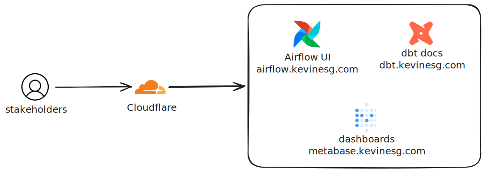

# Environment Setup

This runbook covers shared platform bootstrap and workstation prerequisites.
Start with the root [README.md](../README.md), then use this file for common
setup before following the relevant component README.

This directory is named `deploy` because it owns deployment-facing contracts:
environment bootstrap, host layout, runtime image manifests, and recovery
runbooks. Keep component development commands in component READMEs. If the
platform later adds infrastructure-as-code or broader operations tooling, split
that into a separate `infra/` or `ops/` directory instead of turning `deploy/`
into a catch-all folder.

## Outline

- [Choose The Applicable Path](#choose-the-applicable-path)
- [Environment Topology](#environment-topology)
- [Workstation Tools](#workstation-tools)
- [Bootstrap Environment Values](#bootstrap-environment-values)
- [Platform Bootstrap](#platform-bootstrap)
  - [Bootstrap CLI Configuration](#bootstrap-cli-configuration)
  - [Project State](#project-state)
  - [Billing State](#billing-state)
  - [Shared Service State](#shared-service-state)
- [Component Setup](#component-setup)
- [QA And Prod](#qa-and-prod)
- [Deployment Image Manifest](#deployment-image-manifest)
- [Deployed Web Interfaces](#deployed-web-interfaces)
- [Observability Surfaces](#observability-surfaces)
- [Alerting And Runbooks](#alerting-and-runbooks)
- [Deployed Environment Setup](#deployed-environment-setup)
  - [QA Path Defaults](#qa-path-defaults)
  - [Deployed GCP Workspace](#deployed-gcp-workspace)
  - [QA Host Setup](#qa-host-setup)
  - [QA Deploy](#qa-deploy)
  - [QA Verification](#qa-verification)
  - [Prod Path Defaults](#prod-path-defaults)
  - [Prod Host Setup](#prod-host-setup)
  - [Prod Deploy](#prod-deploy)
  - [Prod Verification](#prod-verification)
  - [Prod Rollback](#prod-rollback)
- [Deployed Metadata Backups](#deployed-metadata-backups)
- [Deployed dbt Docs](#deployed-dbt-docs)
- [Deployed Metabase Runtime](#deployed-metabase-runtime)

## Choose The Applicable Path

The setup responsibilities are intentionally separate:

- Developer setup for an existing dev environment consists of workstation
  tools, assigned component workspace values, and the relevant component README.
  It does not include project creation, billing changes, shared-service
  enablement, or shared identity and access management (IAM) changes.
- A platform maintainer uses the bootstrap sections only when creating an
  environment, recovering it, or repairing a verified configuration gap.
- A platform maintainer provisions component workspaces from the component
  README that owns that runtime.

Every shared-resource section starts with a read-only check. Apply the mutating
command only when the check confirms that the resource or setting is missing.

The normal command flow is:

1. Install and verify workstation tools from **Workstation Tools**.
2. Run **Platform Bootstrap** only for a new shared environment, environment
   recovery, or a verified shared-resource gap.
3. Move to the relevant component README for component workspace provisioning,
   local credentials, runtime setup, and validation.

## Environment Topology

| Environment | Google Cloud project | Ownership |
| --- | --- | --- |
| `dev` | `kevinesg-dev` | Shared development and integration project. |
| `qa` | `kevinesg-qa` | Centrally managed release-validation project. |
| `prod` | `kevinesg-prod` | Centrally managed production project. |

The shared dev project contains separate component service accounts, a raw
BigQuery dataset, a dbt target dataset, and a Cloud Storage landing bucket for
each developer. Additional team or temporary sandbox projects are justified
only when project-level IAM, enabled services, quotas, costs, or infrastructure
changes need a stronger boundary.

QA and prod are provisioned once and do not use developer-specific resources.

## Workstation Tools

Install tools from their official documentation:

- [Git](https://git-scm.com/downloads)
- [GitHub CLI](https://cli.github.com/)
- [Google Cloud CLI](https://cloud.google.com/sdk/docs/install)
- [uv](https://docs.astral.sh/uv/getting-started/installation/)
- [Docker Engine](https://docs.docker.com/engine/install/) or
  [Docker Desktop](https://docs.docker.com/desktop/)

The Google Cloud CLI installation must include `gcloud` and `bq`.

```bash
git --version
gh --version
gcloud --version
bq version
uv --version
docker version
docker compose version
```

Authenticate GitHub CLI once per workstation:

```bash
gh auth login
gh auth status
```

The [`gh auth login` reference](https://cli.github.com/manual/gh_auth_login)
documents browser, SSH, HTTPS, token, and headless options.

## Bootstrap Environment Values

Set these values before running shared bootstrap command blocks in this runbook.
The component READMEs repeat their own required values so each component setup
can be followed independently.

For shared dev:

```bash
export ENVIRONMENT=dev
export PROJECT_ID=kevinesg-dev
export PROJECT_NAME="Data Platform Dev"
export BIGQUERY_LOCATION=US
```

For QA:

```bash
export ENVIRONMENT=qa
export PROJECT_ID=kevinesg-qa
export PROJECT_NAME="Data Platform QA"
export BIGQUERY_LOCATION=US
```

For prod:

```bash
export ENVIRONMENT=prod
export PROJECT_ID=kevinesg-prod
export PROJECT_NAME="Data Platform Prod"
export BIGQUERY_LOCATION=US
```

## Platform Bootstrap

This section is for an authorized platform maintainer. Team members joining an
existing dev environment skip to the relevant component README after receiving
their assigned workspace values.

### Bootstrap CLI Configuration

A gcloud configuration is a local group of CLI properties. Its name does not
grant Google Cloud permissions. `data-platform-bootstrap-$ENVIRONMENT`
describes its purpose; the authenticated account still needs the required IAM
roles.

```bash
export PLATFORM_BOOTSTRAP_CONFIGURATION="data-platform-bootstrap-$ENVIRONMENT"

test -n "$ENVIRONMENT"
test -n "$PROJECT_ID"
test -n "$PROJECT_NAME"
test -n "$BIGQUERY_LOCATION"

if gcloud config configurations describe \
  "$PLATFORM_BOOTSTRAP_CONFIGURATION" >/dev/null 2>&1; then
  gcloud config configurations activate "$PLATFORM_BOOTSTRAP_CONFIGURATION"
else
  gcloud config configurations create "$PLATFORM_BOOTSTRAP_CONFIGURATION"
fi

gcloud auth login

export GOOGLE_CLOUD_BOOTSTRAP_ACCOUNT="$(
  gcloud auth list --filter=status:ACTIVE --format='value(account)'
)"

gcloud config set account "$GOOGLE_CLOUD_BOOTSTRAP_ACCOUNT"
gcloud config set project "$PROJECT_ID"
gcloud config list
```

Before each mutating bootstrap command, confirm that the active account and
project are correct.

### Project State

Check the project:

```bash
gcloud projects describe "$PROJECT_ID" \
  --format='value(projectId,lifecycleState)'
```

An `ACTIVE` result means the project already exists; do not create it again.
Only when the command returns `NOT_FOUND` does a platform maintainer run:

```bash
gcloud projects create "$PROJECT_ID" \
  --name="$PROJECT_NAME" \
  --labels="environment=$ENVIRONMENT,system=data-platform"
```

Any error other than `NOT_FOUND` must be investigated instead of treated as a
missing project. Project creation requires the appropriate organization-level
permission. See Google's [project creation
documentation](https://cloud.google.com/resource-manager/docs/creating-managing-projects).

### Billing State

Check whether billing is already linked:

```bash
gcloud billing projects describe "$PROJECT_ID" \
  --format='value(projectId,billingEnabled,billingAccountName)'
```

When `billingEnabled` is `True`, do not relink billing. When it is `False`, an
authorized platform maintainer selects an open billing account and links it:

```bash
gcloud billing accounts list --filter='open=true'

read -r -p "Billing account ID to link: " BILLING_ACCOUNT_ID
test -n "$BILLING_ACCOUNT_ID"

gcloud billing projects link "$PROJECT_ID" \
  --billing-account="$BILLING_ACCOUNT_ID"

gcloud billing projects describe "$PROJECT_ID" \
  --format='value(projectId,billingEnabled,billingAccountName)'
```

If no billing account is available, use the
[Cloud Billing account
workflow](https://cloud.google.com/billing/docs/how-to/create-billing-account).
Payment-profile setup is completed in the Google Cloud console.

### Shared Service State

The platform maintainer enables shared services once per project. Developer
workstation setup only verifies the existing state.

The following guard enables only missing services:

```bash
enable_missing_platform_services() {
  local required_platform_services=(
    bigquery.googleapis.com
    storage.googleapis.com
    iam.googleapis.com
    serviceusage.googleapis.com
  )
  local enabled_platform_services
  local missing_platform_services=()

  enabled_platform_services="$(
    gcloud services list \
      --enabled \
      --project="$PROJECT_ID" \
      --format='value(config.name)'
  )" || return 1

  for required_service in "${required_platform_services[@]}"; do
    if ! printf '%s\n' "$enabled_platform_services" |
      grep -Fxq "$required_service"; then
      missing_platform_services+=("$required_service")
    fi
  done

  if ((${#missing_platform_services[@]})); then
    gcloud services enable \
      "${missing_platform_services[@]}" \
      --project="$PROJECT_ID"
  else
    echo "All required shared services are enabled."
  fi
}

enable_missing_platform_services
```

Verify the exact services without the deprecated substring-filter behavior:

```bash
gcloud services list \
  --enabled \
  --project="$PROJECT_ID" \
  --filter='config.name~"^(bigquery|iam|serviceusage|storage)\.googleapis\.com$"' \
  --format='value(config.name)' \
  --sort-by='config.name'
```

`gcloud services enable` is state-idempotent: an enabled service stays enabled.
However, each invocation can create a new long-running operation, so different
operation IDs do not mean the service was enabled twice. Use the read-only list
check instead of repeatedly calling `enable`. Additional dependency services,
such as `bigquerystorage.googleapis.com`, can appear in the enabled-service list.

## Component Setup

After shared platform bootstrap, component-specific setup lives with the
component that owns the runtime. Each component README is written as an
end-to-end path for that component so operators do not have to combine commands
from unrelated runtime sections.

- [scripts/README.md](../scripts/README.md) owns the scripts service account,
  landing bucket, raw dataset, external service-account key, environment file
  setup, and scripts verification.
- [dbt/README.md](../dbt/README.md) owns the dbt service account, dbt target
  dataset, raw read grant, external service-account key, external dbt profile,
  and `dbt debug`.
- [airflow/README.md](../airflow/README.md) owns the local orchestration
  runtime, image variables, Compose setup, and DAG validation.
- [metabase/README.md](../metabase/README.md) owns analytics service setup,
  local/deployed Compose commands, and BigQuery read-only connection setup.

Shared project creation, billing, shared API enablement, and workstation tool
installation remain in this runbook because they are cross-component platform
setup.

## QA And Prod

QA and prod project bootstrap is performed once by platform maintainers.
Environment configuration belongs on the matching deployment platform or an
authorized administration host, not on a development workstation.

Each environment uses dedicated service-account JSON files stored outside the
repository on its deployment platform or authorized administration host. Mount
keys read-only into runtime containers, restrict filesystem access, and rotate
or revoke keys immediately after suspected exposure. QA and prod keys must not
be stored on development workstations.

## Deployment Image Manifest

Deployed environments use an external non-secret `images.env` file beside the
external secret `.env` file. The image manifest pins each runtime component to
an immutable GHCR tag produced by
[.github/workflows/publish-images.yml](../.github/workflows/publish-images.yml).

```text
$HOME/secrets/data-platform/qa/images.env
$HOME/secrets/data-platform/prod/images.env
```

Create the first copy from
[deploy/images.env.example](images.env.example) after the publishing workflow
has produced fresh image tags for the rebuilt repository. Replace every
`sha-change-me` value with a real `sha-<commit-sha>` tag.

`images.env` is disposable deployment state, not a secret. Recreate it from the
published image set during clean rebuilds. Do not commit environment-specific
copies.

Normal production promotion copies the exact immutable image refs that passed
QA. The first wremotely production launch has an explicitly approved one-time
exception because the QA serving environment is not provisioned yet. That
exception uses a separate bootstrap manifest created from three images built
from the same `main` commit. It does not permit mutable tags or make QA optional
for later releases. See **One-Time First Production Bootstrap Without QA**.

## Deployed Web Interfaces

External web access uses Cloudflare Tunnel hostnames that forward to services
bound on the deployment host. Keep runtime containers bound to localhost unless
direct LAN access is intentionally required.



| Surface | Hostname | Current posture |
| --- | --- | --- |
| Airflow | [airflow.kevinesg.com](https://airflow.kevinesg.com) | Authenticated operational UI. Public-viewer credentials are future work and must be read-only before broader sharing. |
| Metabase | [metabase.kevinesg.com](https://metabase.kevinesg.com) | Authenticated analytics UI. Public access should be limited to explicitly reviewed public dashboards later. |
| dbt docs | [dbt.kevinesg.com](https://dbt.kevinesg.com) | Static docs refresh workflow added. Public exposure waits for generated metadata review. |
| Data-quality dashboard | TBD | Backlog. No dashboard product is selected yet. |

Airflow and Metabase remain protected by application login and role-based
access control. Do not expose Airflow anonymously. Do not expose Metabase admin,
query-builder, or database-connection pages publicly.

Static dbt docs and future data-quality reports can be made externally visible
only after reviewing generated metadata for sensitive project, source, column,
description, test, owner, or incident details. If those reports contain
sensitive metadata, keep them behind access control.

## Observability Surfaces

The current production observability baseline is intentionally simple. Add new
tooling only when it produces operational signal that changes how failures are
triaged.

| Surface | Owner | Purpose | Status |
| --- | --- | --- | --- |
| Airflow UI | Airflow runtime | DAG state, task retries, task logs, import errors, and manual triggers. | Active through `airflow.kevinesg.com`. |
| dbt artifacts | dbt runtime | Manifest, catalog, run results, source freshness, and docs metadata. | Generated during dbt commands. External archival is deferred until a concrete consumer needs it. Do not commit generated artifacts. |
| dbt docs | dbt runtime | Static documentation for models, tests, lineage, and column contracts. | Refresh workflow added for `dbt.kevinesg.com`; expose only after metadata review. |
| Native dbt freshness and monitor tests | dbt observability runtime | Source freshness and selected data-quality checks run outside every business DAG when they have useful signal. | Backlog. Add after audit-backed freshness checks or intentional non-blocking monitor tests exist. |
| Data-quality dashboard | Observability runtime | Dashboard view for data quality history, incidents, alerts, and metadata if native dbt checks are not enough. | Backlog decision. No product is selected yet. |
| Metabase | Analytics runtime | Business-facing dashboards and exploration, not pipeline incident triage. | Active through `metabase.kevinesg.com`. |
| BigQuery metadata | Platform operations | Table storage, table age, row counts, and warehouse cost investigations. | Planned as targeted runbook queries. |

Generated dbt docs, future data-quality reports, and dbt artifacts belong in
external runtime storage with explicit retention, not in Git. Add artifact
archival only when a concrete consumer needs historical files or queryable run
history beyond Airflow, dbt docs, and native checks.

Business DAGs run the blocking `dbt build` tests for the graph they publish. A
dedicated observability DAG or workflow belongs in backlog until it has useful
signal, such as audit-backed freshness checks or intentionally non-blocking
monitor tests. Do not run all freshness checks or all dbt tests in every
business DAG.

Warehouse storage monitoring should use BigQuery metadata views such as
`INFORMATION_SCHEMA.TABLE_STORAGE` only through bounded, environment-specific
queries. Do not run broad cross-project storage scans from pull-request CI.

## Alerting And Runbooks

Airflow task failure alerts are implemented in the Airflow component as a
best-effort callback. Production operators should still use Airflow, dbt logs,
warehouse metadata, and deployment workflow history as the source of truth for
triage.

Keep the alerting contract narrow:

- Alert on production failures that need action, not every retry or expected
  transient condition.
- Include DAG or workflow name, task or job name, run identifier, failure time,
  and a link to the owning UI or workflow run.
- Do not include secrets, raw records, credentials, or sensitive source values
  in alert payloads.
- Route ownership by component or pipeline so the responder knows whether to
  inspect scripts, dbt, Airflow, Metabase, GitHub Actions, or cloud resources.
- Add deduplication or grouping before alert volume becomes noisy.
- Do not send success alerts by default.

Airflow alert delivery is enabled by setting a webhook URL in the external
environment file used by the deployed Airflow stack. Create the webhook through
Slack's app settings: create or open a Slack app, enable **Incoming Webhooks**,
select **Add New Webhook to Workspace**, choose the alert channel, authorize the
app, and copy the generated webhook URL. Slack treats this URL as a secret.

```dotenv
AIRFLOW__API__BASE_URL=<Airflow UI URL>
DATA_PLATFORM_AIRFLOW_FAILURE_ALERT_WEBHOOK_URL=<Slack incoming webhook URL>
```

Keep the webhook URL out of Git. Leave it unset for manual-only QA unless alert
delivery is being tested; use a separate QA channel when testing. If a webhook
URL is exposed in chat, logs, screenshots, or Git, revoke it in Slack and create
a replacement.

Set `AIRFLOW__API__BASE_URL` to the URL operators should open from Slack, such
as `https://airflow.kevinesg.com` for prod.

Test deployed alert delivery from the target Airflow stack after setting
`DATA_PLATFORM_AIRFLOW_FAILURE_ALERT_WEBHOOK_URL` in that environment's
external `.env` file, deploying an Airflow image that contains the alert
callback, and recreating the Airflow containers.

Airflow callbacks run only when a DAG or task state changes because a worker
executed it. Manually marking a task as failed from the UI or CLI updates
metadata state but does not execute the failure callback. Use the manual
callback test below to verify Slack delivery, or trigger a real task execution
that fails.

For QA:

```bash
export QA_REPO_DIR="$HOME/qa/data-platform"
export QA_ENV_FILE="$HOME/secrets/data-platform/qa/.env"
export QA_IMAGE_ENV_FILE="$HOME/secrets/data-platform/qa/images.env"

cd "$QA_REPO_DIR/airflow"
set -a
. "$QA_IMAGE_ENV_FILE"
set +a

DATA_PLATFORM_ENV_FILE="$QA_ENV_FILE" \
  docker compose --env-file "$QA_ENV_FILE" -f docker-compose.yml exec -T scheduler python - <<'PY'
import os
import sys
from types import SimpleNamespace

sys.path.insert(0, "/opt/airflow/dags")

from _alerting import send_failure_alert

send_failure_alert(
    {
        "task_instance": SimpleNamespace(
            dag_id="alert_test",
            task_id="manual_test",
            log_url=os.getenv("AIRFLOW__API__BASE_URL", "http://localhost:8081"),
        ),
        "dag_run": SimpleNamespace(run_id="manual_alert_test"),
        "ts": "manual test",
        "exception": RuntimeError("manual Slack alert test"),
    }
)
PY
```

For prod:

```bash
export PROD_REPO_DIR="$HOME/prod/data-platform"
export PROD_ENV_FILE="$HOME/secrets/data-platform/prod/.env"
export PROD_IMAGE_ENV_FILE="$HOME/secrets/data-platform/prod/images.env"

cd "$PROD_REPO_DIR/airflow"
set -a
. "$PROD_IMAGE_ENV_FILE"
set +a

DATA_PLATFORM_ENV_FILE="$PROD_ENV_FILE" \
  docker compose --env-file "$PROD_ENV_FILE" -f docker-compose.yml exec -T scheduler python - <<'PY'
import os
import sys
from types import SimpleNamespace

sys.path.insert(0, "/opt/airflow/dags")

from _alerting import send_failure_alert

send_failure_alert(
    {
        "task_instance": SimpleNamespace(
            dag_id="alert_test",
            task_id="manual_test",
            log_url=os.getenv("AIRFLOW__API__BASE_URL", "https://airflow.kevinesg.com"),
        ),
        "dag_run": SimpleNamespace(run_id="manual_alert_test"),
        "ts": "manual test",
        "exception": RuntimeError("manual Slack alert test"),
    }
)
PY
```

The manual `python` process adds `/opt/airflow/dags` to `sys.path` because it
does not run through Airflow's DAG importer.

Runbooks should stay close to ownership boundaries:

- deployment failures and environment recovery live in this file;
- scripts extract/load failures live under `scripts/` or the source pipeline
  docs.
- dbt model, test, and docs failures live under `dbt/`;
- Airflow runtime and DAG import failures live under `airflow/`;
- Metabase application database and analytics runtime failures live under
  `metabase/`.

## Deployed Environment Setup

### QA Path Defaults

QA deployment uses:

```text
QA repo clone:     $HOME/qa/data-platform
QA secrets file:   $HOME/secrets/data-platform/qa/.env
QA image manifest: $HOME/secrets/data-platform/qa/images.env
QA runner dir:     $HOME/actions-runners/data-platform/qa
QA runner label:   data-platform-qa
```

The `deploy-qa` workflow defaults to those paths. Add GitHub environment
variables only when the host uses different absolute paths:

```text
QA_REPO_DIR
QA_DATA_PLATFORM_ENV_FILE
QA_IMAGE_ENV_FILE
```

### Deployed GCP Workspace

Run this section once per deployed environment as a platform maintainer after
the GCP project exists and billing is enabled. If the project does not exist
yet, use **Platform Bootstrap** first with the matching environment values from
**Bootstrap Environment Values**. Use an authenticated machine with permission
to enable APIs, create service accounts, create buckets/datasets, grant IAM, and
create service-account keys.

For QA:

```bash
export ENVIRONMENT=qa
export PROJECT_ID=kevinesg-qa
```

For prod:

```bash
export ENVIRONMENT=prod
export PROJECT_ID=kevinesg-prod
```

Then set the shared deployed workspace values:

```bash
export BIGQUERY_LOCATION=US
export RAW_DATASET=raw
export DBT_DEFAULT_DATASET=analytics
export DBT_DATASETS="analytics staging intermediate seed_personal_finance mart_personal_finance"
export LANDING_BUCKET="$PROJECT_ID-data-platform-landing"
export SCRIPTS_SERVICE_ACCOUNT_NAME="data-platform-scripts-$ENVIRONMENT"
export DBT_SERVICE_ACCOUNT_NAME="data-platform-dbt-$ENVIRONMENT"
export SCRIPTS_SERVICE_ACCOUNT_EMAIL="$SCRIPTS_SERVICE_ACCOUNT_NAME@$PROJECT_ID.iam.gserviceaccount.com"
export DBT_SERVICE_ACCOUNT_EMAIL="$DBT_SERVICE_ACCOUNT_NAME@$PROJECT_ID.iam.gserviceaccount.com"
export SECRETS_DIR="$HOME/secrets/data-platform/$ENVIRONMENT"
export SCRIPTS_GOOGLE_APPLICATION_CREDENTIALS="$SECRETS_DIR/scripts-service-account.json"
export DBT_GOOGLE_APPLICATION_CREDENTIALS="$SECRETS_DIR/dbt-service-account.json"

gcloud config set project "$PROJECT_ID"
gcloud config list
```

Enable missing services:

```bash
enable_missing_deployed_services() {
  local required_services=(
    bigquery.googleapis.com
    drive.googleapis.com
    iam.googleapis.com
    serviceusage.googleapis.com
    sheets.googleapis.com
    storage.googleapis.com
  )
  local enabled_services
  local missing_services=()

  enabled_services="$(
    gcloud services list \
      --enabled \
      --project="$PROJECT_ID" \
      --format='value(config.name)'
  )" || return 1

  for required_service in "${required_services[@]}"; do
    if ! printf '%s\n' "$enabled_services" |
      grep -Fxq "$required_service"; then
      missing_services+=("$required_service")
    fi
  done

  if ((${#missing_services[@]})); then
    gcloud services enable \
      "${missing_services[@]}" \
      --project="$PROJECT_ID"
  else
    echo "All required deployed-environment services are enabled."
  fi
}

enable_missing_deployed_services
```

Create or verify service accounts:

```bash
if gcloud iam service-accounts describe \
  "$SCRIPTS_SERVICE_ACCOUNT_EMAIL" \
  --project="$PROJECT_ID" >/dev/null 2>&1; then
  echo "Service account already exists: $SCRIPTS_SERVICE_ACCOUNT_EMAIL"
else
  gcloud iam service-accounts create "$SCRIPTS_SERVICE_ACCOUNT_NAME" \
    --project="$PROJECT_ID" \
    --display-name="Data Platform Scripts $ENVIRONMENT"
fi

if gcloud iam service-accounts describe \
  "$DBT_SERVICE_ACCOUNT_EMAIL" \
  --project="$PROJECT_ID" >/dev/null 2>&1; then
  echo "Service account already exists: $DBT_SERVICE_ACCOUNT_EMAIL"
else
  gcloud iam service-accounts create "$DBT_SERVICE_ACCOUNT_NAME" \
    --project="$PROJECT_ID" \
    --display-name="Data Platform dbt $ENVIRONMENT"
fi
```

Wait until both service accounts are visible to IAM before granting roles. This
avoids transient `service account does not exist` failures immediately after
creation:

```bash
wait_for_service_account() {
  local service_account_email="$1"
  local attempt

  for attempt in {1..12}; do
    if gcloud iam service-accounts describe \
      "$service_account_email" \
      --project="$PROJECT_ID" >/dev/null 2>&1; then
      echo "Service account is visible: $service_account_email"
      return 0
    fi

    echo "Waiting for service account to propagate: $service_account_email"
    sleep 10
  done

  gcloud iam service-accounts describe \
    "$service_account_email" \
    --project="$PROJECT_ID"
}

wait_for_service_account "$SCRIPTS_SERVICE_ACCOUNT_EMAIL"
wait_for_service_account "$DBT_SERVICE_ACCOUNT_EMAIL"
```

Grant project-level BigQuery job permissions:

```bash
add_project_iam_binding_with_retry() {
  local member="$1"
  local role="$2"
  local attempt

  for attempt in {1..6}; do
    if gcloud projects add-iam-policy-binding "$PROJECT_ID" \
      --member="$member" \
      --role="$role"; then
      return 0
    fi

    echo "Retrying IAM binding after propagation delay: $member $role"
    sleep 10
  done

  gcloud projects add-iam-policy-binding "$PROJECT_ID" \
    --member="$member" \
    --role="$role"
}

add_project_iam_binding_with_retry \
  "serviceAccount:$SCRIPTS_SERVICE_ACCOUNT_EMAIL" \
  "roles/bigquery.jobUser"

add_project_iam_binding_with_retry \
  "serviceAccount:$DBT_SERVICE_ACCOUNT_EMAIL" \
  "roles/bigquery.jobUser"
```

Create or verify the landing bucket:

```bash
if gcloud storage buckets describe \
  "gs://$LANDING_BUCKET" \
  --project="$PROJECT_ID" >/dev/null 2>&1; then
  echo "Landing bucket already exists: gs://$LANDING_BUCKET"
else
  gcloud storage buckets create "gs://$LANDING_BUCKET" \
    --project="$PROJECT_ID" \
    --location="$BIGQUERY_LOCATION" \
    --uniform-bucket-level-access \
    --public-access-prevention
fi

gcloud storage buckets add-iam-policy-binding "gs://$LANDING_BUCKET" \
  --member="serviceAccount:$SCRIPTS_SERVICE_ACCOUNT_EMAIL" \
  --role="roles/storage.objectAdmin"
```

Create or verify BigQuery datasets and grants:

```bash
if bq show \
  --project_id="$PROJECT_ID" \
  "$PROJECT_ID:$RAW_DATASET" >/dev/null 2>&1; then
  echo "Raw dataset already exists: $PROJECT_ID:$RAW_DATASET"
else
  bq --location="$BIGQUERY_LOCATION" mk \
    --dataset \
    "$PROJECT_ID:$RAW_DATASET"
fi

for DBT_DATASET_NAME in $DBT_DATASETS; do
  if bq show \
    --project_id="$PROJECT_ID" \
    "$PROJECT_ID:$DBT_DATASET_NAME" >/dev/null 2>&1; then
    echo "dbt dataset already exists: $PROJECT_ID:$DBT_DATASET_NAME"
  else
    bq --location="$BIGQUERY_LOCATION" mk \
      --dataset \
      "$PROJECT_ID:$DBT_DATASET_NAME"
  fi
done

bq query \
  --project_id="$PROJECT_ID" \
  --location="$BIGQUERY_LOCATION" \
  --use_legacy_sql=false \
  "GRANT \`roles/bigquery.dataEditor\`
   ON SCHEMA \`$PROJECT_ID\`.$RAW_DATASET
   TO \"serviceAccount:$SCRIPTS_SERVICE_ACCOUNT_EMAIL\""

bq query \
  --project_id="$PROJECT_ID" \
  --location="$BIGQUERY_LOCATION" \
  --use_legacy_sql=false \
  "GRANT \`roles/bigquery.dataViewer\`
   ON SCHEMA \`$PROJECT_ID\`.$RAW_DATASET
   TO \"serviceAccount:$DBT_SERVICE_ACCOUNT_EMAIL\""

for DBT_DATASET_NAME in $DBT_DATASETS; do
  bq query \
    --project_id="$PROJECT_ID" \
    --location="$BIGQUERY_LOCATION" \
    --use_legacy_sql=false \
    "GRANT \`roles/bigquery.dataEditor\`
     ON SCHEMA \`$PROJECT_ID\`.$DBT_DATASET_NAME
     TO \"serviceAccount:$DBT_SERVICE_ACCOUNT_EMAIL\""
done
```

Create service-account keys only when the external files do not already exist:

```bash
mkdir -p "$SECRETS_DIR"
chmod 700 "$SECRETS_DIR"

if test -f "$SCRIPTS_GOOGLE_APPLICATION_CREDENTIALS"; then
  echo "Scripts service-account key already exists."
else
  gcloud iam service-accounts keys create \
    "$SCRIPTS_GOOGLE_APPLICATION_CREDENTIALS" \
    --iam-account="$SCRIPTS_SERVICE_ACCOUNT_EMAIL" \
    --project="$PROJECT_ID"
fi

if test -f "$DBT_GOOGLE_APPLICATION_CREDENTIALS"; then
  echo "dbt service-account key already exists."
else
  gcloud iam service-accounts keys create \
    "$DBT_GOOGLE_APPLICATION_CREDENTIALS" \
    --iam-account="$DBT_SERVICE_ACCOUNT_EMAIL" \
    --project="$PROJECT_ID"
fi

chmod 600 "$SCRIPTS_GOOGLE_APPLICATION_CREDENTIALS" "$DBT_GOOGLE_APPLICATION_CREDENTIALS"
```

Share the personal finance Google Sheet with the deployed scripts service
account:

```text
data-platform-scripts-qa@kevinesg-qa.iam.gserviceaccount.com
data-platform-scripts-prod@kevinesg-prod.iam.gserviceaccount.com
```

### QA Host Setup

Run this on the deployment host:

```bash
mkdir -p "$HOME/qa"
mkdir -p "$HOME/secrets/data-platform/qa"
mkdir -p "$HOME/actions-runners/data-platform/qa"
chmod 700 "$HOME/secrets/data-platform/qa"

git clone git@github.com:kevinesg/data-platform.git "$HOME/qa/data-platform"
cd "$HOME/qa/data-platform"
git switch main

cp deploy/env.example "$HOME/secrets/data-platform/qa/.env"
cp deploy/images.env.example "$HOME/secrets/data-platform/qa/images.env"
chmod 600 "$HOME/secrets/data-platform/qa/.env" "$HOME/secrets/data-platform/qa/images.env"
```

Edit `$HOME/secrets/data-platform/qa/.env` and set QA values. At minimum,
replace passwords/secrets, `PROJECT_ID`, `PERSONAL_FINANCE_GSHEET_URL`,
`PERSONAL_FINANCE_GCS_BUCKET`, `AIRFLOW_UID`, `DOCKER_GID`, and the absolute
service-account key paths. Keep `PERSONAL_FINANCE_GCS_PREFIX=personal_finance`.

Useful host values:

```bash
id -u
stat -c '%g' /var/run/docker.sock
python -c "import secrets; print(secrets.token_urlsafe(48))"
python -c "import base64, os; print(base64.urlsafe_b64encode(os.urandom(32)).decode())"
realpath "$HOME/secrets/data-platform/qa/scripts-service-account.json"
realpath "$HOME/secrets/data-platform/qa/dbt-service-account.json"
```

Register the QA self-hosted runner from GitHub: repository **Settings** >
**Actions** > **Runners** > **New self-hosted runner**. Use the Linux commands
shown by GitHub from this directory:

```bash
cd "$HOME/actions-runners/data-platform/qa"
```

During runner configuration:

```text
runner group: Default
runner name: a stable repo/environment/host name, for example data-platform-qa-homeserver
additional labels: data-platform-qa
work folder: _work
```

The runner name identifies the installed runner instance in the GitHub UI and
logs. Use a name that stays clear when the same host later runs runners for
other repositories or environments. The `data-platform-qa` label is what
`deploy-qa` uses for job routing.

Install and start the runner service:

```bash
cd "$HOME/actions-runners/data-platform/qa"
sudo ./svc.sh install
sudo ./svc.sh start
sudo ./svc.sh status
```

### QA Deploy

Run GitHub Actions > `deploy-qa` with `git_ref` set to `main`.

The workflow:

1. Updates the persistent QA checkout.
2. Selects the latest published scripts, dbt, and Airflow images that match the
   deployed source history.
3. Writes those refs to `$HOME/secrets/data-platform/qa/images.env`.
4. Runs `dbt compile` in the deployed dbt image with QA credentials.
5. Pulls runtime images and recreates the QA Airflow stack.
6. Runs Airflow DAG import smoke checks.

The `dbt compile` step uses the profile baked into the selected dbt image. That
profile is copied from `dbt/data_warehouse/profiles.yml.example` at image build
time, so the image must include a target matching `DBT_TARGET=qa`.

### QA Verification

Run on the deployment host after `deploy-qa` succeeds:

```bash
export QA_REPO_DIR="$HOME/qa/data-platform"
export QA_ENV_FILE="$HOME/secrets/data-platform/qa/.env"
export QA_IMAGE_ENV_FILE="$HOME/secrets/data-platform/qa/images.env"

cd "$QA_REPO_DIR/airflow"
set -a
. "$QA_IMAGE_ENV_FILE"
set +a

DATA_PLATFORM_ENV_FILE="$QA_ENV_FILE" \
  docker compose --env-file "$QA_ENV_FILE" -f docker-compose.yml ps

DATA_PLATFORM_ENV_FILE="$QA_ENV_FILE" \
  docker compose --env-file "$QA_ENV_FILE" -f docker-compose.yml exec -T api-server cat /opt/airflow/auth/simple_auth_manager_passwords.json.generated

DATA_PLATFORM_ENV_FILE="$QA_ENV_FILE" \
  docker compose --env-file "$QA_ENV_FILE" -f docker-compose.yml exec -T scheduler airflow dags list

DATA_PLATFORM_ENV_FILE="$QA_ENV_FILE" \
  docker compose --env-file "$QA_ENV_FILE" -f docker-compose.yml exec -T scheduler airflow dags list-import-errors
```

The generated Simple Auth password lives in the `airflow-auth` Docker volume and
should persist across normal `deploy-qa`, `docker compose up -d`, and
`--force-recreate` operations. It can change if that volume is deleted, if
`docker compose down -v` is used, or if `AIRFLOW_COMPOSE_PROJECT` changes.

Trigger the personal finance DAG manually from the Airflow UI, or from the
scheduler container when an end-to-end QA run is needed:

```bash
DATA_PLATFORM_ENV_FILE="$QA_ENV_FILE" \
  docker compose --env-file "$QA_ENV_FILE" -f docker-compose.yml exec -T scheduler airflow dags trigger etl__personal_finance
```

After editing `$HOME/secrets/data-platform/qa/.env`, rerun `deploy-qa` or
recreate the stack without deleting volumes:

```bash
cd "$QA_REPO_DIR/airflow"
set -a
. "$QA_IMAGE_ENV_FILE"
set +a

DATA_PLATFORM_ENV_FILE="$QA_ENV_FILE" \
  docker compose --env-file "$QA_ENV_FILE" -f docker-compose.yml up -d --force-recreate --remove-orphans
```

Do not run `docker compose down -v` for ordinary QA configuration changes. That
removes Airflow metadata and Postgres state.

### Prod Path Defaults

Prod deployment uses:

```text
Prod repo clone:           $HOME/prod/data-platform
Prod secrets file:         $HOME/secrets/data-platform/prod/.env
Prod image manifest:       $HOME/secrets/data-platform/prod/images.env
Prod source image manifest: $HOME/secrets/data-platform/qa/images.env
Prod runner dir:           $HOME/actions-runners/data-platform/prod
Prod runner label:         data-platform-prod
```

The `deploy-prod` workflow defaults to those paths. Add GitHub environment
variables only when the host uses different absolute paths:

```text
PROD_REPO_DIR
PROD_DATA_PLATFORM_ENV_FILE
PROD_IMAGE_ENV_FILE
PROD_SOURCE_IMAGE_ENV_FILE
```

`PROD_SOURCE_IMAGE_ENV_FILE` defaults to the QA image manifest. Prod deployment
promotes those immutable image refs into the prod image manifest, so prod runs
the same image set that was deployed to QA.

Do not point this variable at a developer or dev-environment manifest. The only
supported non-QA source is the temporary first-launch bootstrap manifest below.

### Prod Host Setup

Run this on the deployment host after the prod GCP workspace is provisioned with
**Deployed GCP Workspace**:

```bash
mkdir -p "$HOME/prod"
mkdir -p "$HOME/secrets/data-platform/prod"
mkdir -p "$HOME/actions-runners/data-platform/prod"
chmod 700 "$HOME/secrets/data-platform/prod"

git clone git@github.com:kevinesg/data-platform.git "$HOME/prod/data-platform"
cd "$HOME/prod/data-platform"
git switch main

cp deploy/env.example "$HOME/secrets/data-platform/prod/.env"
cp deploy/images.env.example "$HOME/secrets/data-platform/prod/images.env"
chmod 600 "$HOME/secrets/data-platform/prod/.env" "$HOME/secrets/data-platform/prod/images.env"
```

Edit `$HOME/secrets/data-platform/prod/.env` and set prod values. At minimum:

```text
AIRFLOW_COMPOSE_PROJECT=data-platform-airflow-prod
AIRFLOW_API_PORT=<prod Airflow port that does not conflict on the host>
AIRFLOW__API__BASE_URL=https://airflow.kevinesg.com
ENVIRONMENT=prod
PROJECT_ID=kevinesg-prod
PERSONAL_FINANCE_GCS_BUCKET=kevinesg-prod-data-platform-landing
SCRIPTS_GOOGLE_APPLICATION_CREDENTIALS=/home/<user>/secrets/data-platform/prod/scripts-service-account.json
DBT_GOOGLE_APPLICATION_CREDENTIALS=/home/<user>/secrets/data-platform/prod/dbt-service-account.json
ETL__PERSONAL_FINANCE_SCHEDULE=<prod cron or preset schedule>
DBT_TARGET=prod
DBT_DATASET=analytics
BIGQUERY_LOCATION=US
```

Also replace all generated Airflow/Postgres passwords and secrets. Keep
`PERSONAL_FINANCE_GCS_PREFIX=personal_finance`. Prod DAG import requires
`ETL__PERSONAL_FINANCE_SCHEDULE` because prod is the scheduled environment; use
QA for manual-only validation.

Useful host values:

```bash
id -u
stat -c '%g' /var/run/docker.sock
python -c "import secrets; print(secrets.token_urlsafe(48))"
python -c "import base64, os; print(base64.urlsafe_b64encode(os.urandom(32)).decode())"
realpath "$HOME/secrets/data-platform/prod/scripts-service-account.json"
realpath "$HOME/secrets/data-platform/prod/dbt-service-account.json"
```

Create a GitHub environment named `prod` before using `deploy-prod`: repository
**Settings** > **Environments** > **New environment**. Configure required
reviewers so prod deployment waits for explicit approval.

Register the prod self-hosted runner from GitHub: repository **Settings** >
**Actions** > **Runners** > **New self-hosted runner**. Use the Linux commands
shown by GitHub from this directory:

```bash
cd "$HOME/actions-runners/data-platform/prod"
```

During runner configuration:

```text
runner group: Default
runner name: a stable repo/environment/host name, for example data-platform-prod-homeserver
additional labels: data-platform-prod
work folder: _work
```

Install and start the runner service:

```bash
cd "$HOME/actions-runners/data-platform/prod"
sudo ./svc.sh install
sudo ./svc.sh start
sudo ./svc.sh status
```

### One-Time First Production Bootstrap Without QA

Use this section only for the explicitly approved first wremotely production
launch while the separate desktop QA serving environment is not yet available.
This is a release-process exception, not an equivalent substitute for QA.

In GitHub Actions, run `publish-images` from `main` with `component=all`. Wait
for all three image jobs to succeed. The manual workflow publishes Airflow,
scripts, and dbt images from one commit, which gives the bootstrap manifest a
single auditable source revision.

Then run this on the production data-platform deployment host after **Prod Host
Setup**. The persistent checkout must be at the same `main` commit used by the
successful `publish-images` run:

```bash
export PROD_REPO_DIR="$HOME/prod/data-platform"
export PROD_BOOTSTRAP_IMAGE_ENV_FILE="$HOME/secrets/data-platform/prod/bootstrap-images.env"

cd "$PROD_REPO_DIR"
git switch main
git pull --ff-only origin main

export BOOTSTRAP_SHA="$(git rev-parse HEAD)"
test "$(git branch --show-current)" = main
test -n "$BOOTSTRAP_SHA"

{
  printf 'DATA_PLATFORM_AIRFLOW_IMAGE=ghcr.io/kevinesg/data-platform-airflow:sha-%s\n' "$BOOTSTRAP_SHA"
  printf 'DATA_PLATFORM_SCRIPTS_IMAGE=ghcr.io/kevinesg/data-platform-scripts:sha-%s\n' "$BOOTSTRAP_SHA"
  printf 'DATA_PLATFORM_DBT_IMAGE=ghcr.io/kevinesg/data-platform-dbt:sha-%s\n' "$BOOTSTRAP_SHA"
} > "$PROD_BOOTSTRAP_IMAGE_ENV_FILE"
chmod 600 "$PROD_BOOTSTRAP_IMAGE_ENV_FILE"

grep -E '^DATA_PLATFORM_(AIRFLOW|SCRIPTS|DBT)_IMAGE=ghcr\.io/kevinesg/data-platform-(airflow|scripts|dbt):sha-[0-9a-f]{40}$' \
  "$PROD_BOOTSTRAP_IMAGE_ENV_FILE"
test "$(wc -l < "$PROD_BOOTSTRAP_IMAGE_ENV_FILE")" -eq 3
```

Compare `BOOTSTRAP_SHA` with the commit shown by the successful
`publish-images` workflow. Stop if they differ; do not substitute `latest`, a
branch tag, or images from different commits.

In repository **Settings** > **Environments** > **prod** > **Environment
variables**, set `PROD_SOURCE_IMAGE_ENV_FILE` to the absolute bootstrap path,
for example:

```text
/home/<runner-user>/secrets/data-platform/prod/bootstrap-images.env
```

Run `deploy-prod` only after that environment variable and file are in place.
The workflow authenticates to GHCR, verifies that all three immutable manifests
exist, and copies the refs into the normal prod image manifest before starting
services.

Keep the bootstrap file and override until the first production deployment and
verification succeed. After QA is provisioned and the same or a later release
passes `deploy-qa`, delete the `PROD_SOURCE_IMAGE_ENV_FILE` environment variable
from the `prod` environment. The next production deployment will then return to
the default `$HOME/secrets/data-platform/qa/images.env` promotion source. After
that QA-sourced production deployment succeeds, remove the obsolete bootstrap
file:

```bash
rm "$HOME/secrets/data-platform/prod/bootstrap-images.env"
```

Deleting the override before QA has produced its image manifest will make
`deploy-prod` fail closed during host-state validation.

### Prod Deploy

Run GitHub Actions > `deploy-prod` with `git_ref` set to the same `main` release
that passed QA. If new commits have landed on `main` since QA validation, rerun
`deploy-qa` and validate QA before promoting prod. For the approved first-launch
exception only, use the exact `main` commit and source manifest prepared in
**One-Time First Production Bootstrap Without QA**.

The workflow:

1. Checks the prod host paths and configured source image manifest.
2. Blocks deployment when existing prod Airflow metadata has queued or running
   DAG runs.
3. Updates the persistent prod checkout.
4. Saves the existing prod image manifest as `images.env.previous`, then
   promotes the configured immutable source image manifest to prod.
5. Runs `dbt compile` in the deployed dbt image with prod credentials.
6. Pulls runtime images and recreates the prod Airflow stack.
7. Runs Airflow DAG import smoke checks.

The prod workflow does not run `dbt build`, dbt tests, or Airflow DAGs. Those
are production operations, not deploy steps.

The workflow retries registry manifest and pull operations because transient
GHCR 5xx or token endpoint failures can happen even when package permissions are
correct. If those failures persist across the built-in retries, wait and rerun
`deploy-prod`.

### Prod Verification

Run on the deployment host after `deploy-prod` succeeds:

```bash
export PROD_REPO_DIR="$HOME/prod/data-platform"
export PROD_ENV_FILE="$HOME/secrets/data-platform/prod/.env"
export PROD_IMAGE_ENV_FILE="$HOME/secrets/data-platform/prod/images.env"

cd "$PROD_REPO_DIR/airflow"
set -a
. "$PROD_IMAGE_ENV_FILE"
set +a

DATA_PLATFORM_ENV_FILE="$PROD_ENV_FILE" \
  docker compose --env-file "$PROD_ENV_FILE" -f docker-compose.yml ps

DATA_PLATFORM_ENV_FILE="$PROD_ENV_FILE" \
  docker compose --env-file "$PROD_ENV_FILE" -f docker-compose.yml exec -T api-server cat /opt/airflow/auth/simple_auth_manager_passwords.json.generated

DATA_PLATFORM_ENV_FILE="$PROD_ENV_FILE" \
  docker compose --env-file "$PROD_ENV_FILE" -f docker-compose.yml exec -T scheduler airflow dags list

DATA_PLATFORM_ENV_FILE="$PROD_ENV_FILE" \
  docker compose --env-file "$PROD_ENV_FILE" -f docker-compose.yml exec -T scheduler airflow dags list-import-errors
```

Do not manually trigger prod DAGs as part of deployment unless you intentionally
want to run that production pipeline. Scheduled/manual prod DAG execution is an
operational action, not a deployment workflow step.

### Prod Rollback

Prod rollback restores the previous runtime image set. It does not undo
warehouse writes from a DAG that already ran, and it does not restore Airflow
metadata. Investigate partial production runs before triggering any follow-up
pipeline execution.

If `deploy-prod` already wrote a new prod image manifest and the previous
manifest exists, restore it and recreate the stack:

```bash
export PROD_REPO_DIR="$HOME/prod/data-platform"
export PROD_ENV_FILE="$HOME/secrets/data-platform/prod/.env"
export PROD_IMAGE_ENV_FILE="$HOME/secrets/data-platform/prod/images.env"

test -f "$PROD_IMAGE_ENV_FILE.previous"
cp "$PROD_IMAGE_ENV_FILE.previous" "$PROD_IMAGE_ENV_FILE"
chmod 600 "$PROD_IMAGE_ENV_FILE"

cd "$PROD_REPO_DIR/airflow"
set -a
. "$PROD_IMAGE_ENV_FILE"
set +a

DATA_PLATFORM_ENV_FILE="$PROD_ENV_FILE" \
  docker compose --env-file "$PROD_ENV_FILE" -f docker-compose.yml up -d --force-recreate --remove-orphans

DATA_PLATFORM_ENV_FILE="$PROD_ENV_FILE" \
  docker compose --env-file "$PROD_ENV_FILE" -f docker-compose.yml ps
```

Do not run `docker compose down -v` for rollback. That removes Airflow metadata
and Postgres state.

## Deployed Metadata Backups

The [backup-metadata](../.github/workflows/backup-metadata.yml) workflow backs
up production Airflow metadata and Metabase application metadata from the prod
self-hosted runner. It runs daily at `18:17` UTC, which is `02:17` Philippine
Time, and can also be started manually.

The workflow runs `pg_dump` inside each service's Postgres container, compresses
the SQL dump with `gzip`, stores backups on the deployment host, and deletes
old backup files after the retention window. Backups are runtime artifacts and
must not be committed.

These local backups protect against application-state mistakes, bad upgrades,
and accidental metadata loss on the deployment host. They do not protect
against host or disk loss; off-host encrypted backup replication is separate
future operations work.

Default prod paths and retention:

```text
Prod repo clone:         $HOME/prod/data-platform
Prod Airflow env file:   $HOME/secrets/data-platform/prod/.env
Prod image manifest:     $HOME/secrets/data-platform/prod/images.env
Prod Metabase env file:  $HOME/secrets/data-platform/prod/metabase.env
Metadata backup root:    $HOME/runtime/data-platform/prod/metadata-backups
Airflow backups:         $HOME/runtime/data-platform/prod/metadata-backups/airflow
Metabase backups:        $HOME/runtime/data-platform/prod/metadata-backups/metabase
Retention:               30 days
```

Add repository variables only when the host uses different absolute paths or
retention:

```text
PROD_REPO_DIR
PROD_DATA_PLATFORM_ENV_FILE
PROD_IMAGE_ENV_FILE
PROD_METABASE_ENV_FILE
METADATA_BACKUP_DIR
METADATA_BACKUP_RETENTION_DAYS
```

Manual backup/debug command on the deployment host:

```bash
export PROD_REPO_DIR="$HOME/prod/data-platform"
export PROD_ENV_FILE="$HOME/secrets/data-platform/prod/.env"
export PROD_IMAGE_ENV_FILE="$HOME/secrets/data-platform/prod/images.env"
export PROD_METABASE_ENV_FILE="$HOME/secrets/data-platform/prod/metabase.env"
export METADATA_BACKUP_DIR="$HOME/runtime/data-platform/prod/metadata-backups"
export BACKUP_TIMESTAMP="$(date -u +%Y%m%dT%H%M%SZ)"

set -euo pipefail

mkdir -p "$METADATA_BACKUP_DIR/airflow" "$METADATA_BACKUP_DIR/metabase"
chmod 700 "$METADATA_BACKUP_DIR" "$METADATA_BACKUP_DIR/airflow" "$METADATA_BACKUP_DIR/metabase"

set -a
. "$PROD_IMAGE_ENV_FILE"
set +a

cd "$PROD_REPO_DIR/airflow"
DATA_PLATFORM_ENV_FILE="$PROD_ENV_FILE" \
  docker compose --env-file "$PROD_ENV_FILE" -f docker-compose.yml exec -T postgres \
  sh -c 'pg_dump -U "$POSTGRES_USER" "$POSTGRES_DB"' |
  gzip -9 > "$METADATA_BACKUP_DIR/airflow/airflow-metadata-$BACKUP_TIMESTAMP.sql.gz"
chmod 600 "$METADATA_BACKUP_DIR/airflow/airflow-metadata-$BACKUP_TIMESTAMP.sql.gz"

cd "$PROD_REPO_DIR/metabase"
DATA_PLATFORM_ENV_FILE="$PROD_METABASE_ENV_FILE" \
  docker compose --env-file "$PROD_METABASE_ENV_FILE" -f docker-compose.yml exec -T postgres \
  sh -c 'pg_dump -U "$POSTGRES_USER" "$POSTGRES_DB"' |
  gzip -9 > "$METADATA_BACKUP_DIR/metabase/metabase-app-$BACKUP_TIMESTAMP.sql.gz"
chmod 600 "$METADATA_BACKUP_DIR/metabase/metabase-app-$BACKUP_TIMESTAMP.sql.gz"
```

These commands pass env files to Docker Compose instead of sourcing the
Metabase env file in Bash. Metabase settings such as `MB_SITE_NAME=Data
Platform` are valid Compose env-file values but are not valid unquoted shell
assignments. The Metabase backup commands use `POSTGRES_USER` and
`POSTGRES_DB` inside the Postgres container; those are derived from the
Metabase `MB_DB_*` Compose values and should not be added to `metabase.env`.

Restore backups only into a fresh or intentionally reset metadata database.
Never pipe a backup into an active populated database as a routine operation.
For Airflow, keep the same `AIRFLOW_FERNET_KEY` when restoring metadata that
contains encrypted Airflow connections or variables. For Metabase, keep the
same `MB_ENCRYPTION_SECRET_KEY` when restoring metadata that contains encrypted
database connection details.

Restore Airflow metadata after the target Airflow stack is stopped or freshly
initialized:

```bash
export PROD_REPO_DIR="$HOME/prod/data-platform"
export PROD_ENV_FILE="$HOME/secrets/data-platform/prod/.env"
export PROD_IMAGE_ENV_FILE="$HOME/secrets/data-platform/prod/images.env"
export AIRFLOW_BACKUP_FILE="$HOME/runtime/data-platform/prod/metadata-backups/airflow/airflow-metadata-backup.sql.gz"

set -euo pipefail

set -a
. "$PROD_IMAGE_ENV_FILE"
set +a

cd "$PROD_REPO_DIR/airflow"

DATA_PLATFORM_ENV_FILE="$PROD_ENV_FILE" \
  docker compose --env-file "$PROD_ENV_FILE" -f docker-compose.yml stop api-server scheduler dag-processor triggerer

gunzip -c "$AIRFLOW_BACKUP_FILE" |
  DATA_PLATFORM_ENV_FILE="$PROD_ENV_FILE" \
    docker compose --env-file "$PROD_ENV_FILE" -f docker-compose.yml exec -T postgres \
    sh -c 'psql -U "$POSTGRES_USER" "$POSTGRES_DB"'

DATA_PLATFORM_ENV_FILE="$PROD_ENV_FILE" \
  docker compose --env-file "$PROD_ENV_FILE" -f docker-compose.yml up -d --force-recreate --remove-orphans
```

Restore Metabase metadata after the target Metabase application service is
stopped or freshly initialized:

```bash
export PROD_REPO_DIR="$HOME/prod/data-platform"
export PROD_METABASE_ENV_FILE="$HOME/secrets/data-platform/prod/metabase.env"
export METABASE_BACKUP_FILE="$HOME/runtime/data-platform/prod/metadata-backups/metabase/metabase-app-backup.sql.gz"

set -euo pipefail

cd "$PROD_REPO_DIR/metabase"

DATA_PLATFORM_ENV_FILE="$PROD_METABASE_ENV_FILE" \
  docker compose --env-file "$PROD_METABASE_ENV_FILE" -f docker-compose.yml stop metabase

gunzip -c "$METABASE_BACKUP_FILE" |
  DATA_PLATFORM_ENV_FILE="$PROD_METABASE_ENV_FILE" \
    docker compose --env-file "$PROD_METABASE_ENV_FILE" -f docker-compose.yml exec -T postgres \
    sh -c 'psql -U "$POSTGRES_USER" "$POSTGRES_DB"'

DATA_PLATFORM_ENV_FILE="$PROD_METABASE_ENV_FILE" \
  docker compose --env-file "$PROD_METABASE_ENV_FILE" -f docker-compose.yml up -d --force-recreate --remove-orphans
```

After any restore, validate the owning UI and run the normal Airflow or
Metabase verification commands before treating the restored service as healthy.
Test restore on a non-production or intentionally reset target before relying on
the backup workflow as a production control.

## Deployed dbt Docs

dbt docs are generated from the deployed prod dbt image so the documentation
matches the dbt code and profile contract selected for prod. Generated files are
runtime artifacts and must not be committed.

The [refresh-dbt-docs](../.github/workflows/refresh-dbt-docs.yml) workflow runs
after successful `deploy-prod` workflow runs and can also be started manually.
It reads the deployed prod image manifest and environment file from the
deployment host, generates a static `static_index.html`, copies it to a runtime
directory, and serves it with nginx bound to localhost.

Automatic runs skip docs generation when the existing `index.html` was produced
from the same deployed dbt image recorded in `.dbt-image`. Manual workflow runs
always regenerate docs and recreate the serving container.

Default prod paths and port:

```text
Prod repo clone:        $HOME/prod/data-platform
Prod secrets file:      $HOME/secrets/data-platform/prod/.env
Prod image manifest:    $HOME/secrets/data-platform/prod/images.env
dbt docs directory:     $HOME/runtime/data-platform/prod/dbt-docs
dbt docs target dir:    $HOME/runtime/data-platform/prod/dbt-docs-target
dbt docs local URL:     http://127.0.0.1:8082
dbt docs container:     data-platform-dbt-docs-prod
```

Add repository variables only when the host uses different absolute paths or
port:

```text
PROD_REPO_DIR
PROD_DATA_PLATFORM_ENV_FILE
PROD_IMAGE_ENV_FILE
DBT_DOCS_DIR
DBT_DOCS_TARGET_DIR
DBT_DOCS_PORT
```

Manual recovery/debug command on the deployment host:

```bash
export PROD_REPO_DIR="$HOME/prod/data-platform"
export PROD_ENV_FILE="$HOME/secrets/data-platform/prod/.env"
export PROD_IMAGE_ENV_FILE="$HOME/secrets/data-platform/prod/images.env"
export DBT_DOCS_DIR="$HOME/runtime/data-platform/prod/dbt-docs"
export DBT_DOCS_TARGET_DIR="$HOME/runtime/data-platform/prod/dbt-docs-target"
export DBT_DOCS_PORT=8082
export DBT_DOCS_CONTAINER=data-platform-dbt-docs-prod

mkdir -p "$DBT_DOCS_DIR" "$DBT_DOCS_TARGET_DIR"
chmod 755 "$DBT_DOCS_DIR"

set -a
. "$PROD_IMAGE_ENV_FILE"
. "$PROD_ENV_FILE"
set +a

test -n "$DATA_PLATFORM_DBT_IMAGE"
test -n "$DBT_GOOGLE_APPLICATION_CREDENTIALS"
test -f "$DBT_GOOGLE_APPLICATION_CREDENTIALS"

docker_pull_with_retry() {
  local image="$1"
  local attempt

  for attempt in {1..5}; do
    if docker pull "$image"; then
      return 0
    fi

    echo "Retrying pull after registry failure: $image"
    sleep 15
  done

  docker pull "$image"
}

docker_pull_with_retry "$DATA_PLATFORM_DBT_IMAGE"
docker run --rm \
  --mount "type=bind,source=$DBT_GOOGLE_APPLICATION_CREDENTIALS,target=/credentials/dbt-service-account.json,readonly" \
  --mount "type=bind,source=$DBT_DOCS_TARGET_DIR,target=/app/data_warehouse/target" \
  -e DBT_TARGET \
  -e PROJECT_ID \
  -e RAW_DATASET \
  -e DBT_DATASET \
  -e DBT_THREADS \
  -e BIGQUERY_LOCATION \
  -e DBT_GOOGLE_APPLICATION_CREDENTIALS=/credentials/dbt-service-account.json \
  "$DATA_PLATFORM_DBT_IMAGE" docs generate \
    --project-dir data_warehouse \
    --target "$DBT_TARGET" \
    --static

test -f "$DBT_DOCS_TARGET_DIR/static_index.html"
cp "$DBT_DOCS_TARGET_DIR/static_index.html" "$DBT_DOCS_DIR/index.html"
printf '%s\n' "$DATA_PLATFORM_DBT_IMAGE" > "$DBT_DOCS_DIR/.dbt-image"
chmod 644 "$DBT_DOCS_DIR/index.html" "$DBT_DOCS_DIR/.dbt-image"

docker rm -f "$DBT_DOCS_CONTAINER" 2>/dev/null || true
docker run -d \
  --name "$DBT_DOCS_CONTAINER" \
  --restart unless-stopped \
  -p "127.0.0.1:$DBT_DOCS_PORT:80" \
  --mount "type=bind,source=$DBT_DOCS_DIR,target=/usr/share/nginx/html,readonly" \
  nginx:alpine

curl --fail --silent --head "http://127.0.0.1:$DBT_DOCS_PORT" >/dev/null
```

For Cloudflare Tunnel, point `dbt.kevinesg.com` to
`http://localhost:8082`. Keep nginx bound to `127.0.0.1` unless direct LAN
access is intentional.

Review generated dbt docs before public exposure. Treat model names, source
names, column names, descriptions, test names, lineage, and compiled SQL as
potentially sensitive metadata. If the generated docs contain sensitive
metadata, keep the hostname behind Cloudflare Access, an identity-aware proxy,
VPN, or another authenticated front door instead of publishing it anonymously.

## Deployed Metabase Runtime

The default deployment strategy is one prod Metabase instance, not matching
Metabase instances for dev, QA, and prod. Metabase carries application state such
as users, dashboards, questions, collections, permissions, and database
connections; add a separate QA Metabase only when there is a concrete dashboard
review, permission, embedded analytics, plugin, upgrade, or serialization need.

The deployed Metabase instance uses a separate external
`$HOME/secrets/data-platform/prod/metabase.env` file. It does not use the prod
Airflow/dbt `.env` file or `images.env` because Metabase runs from the official
pinned `METABASE_IMAGE`, not a repo-built GHCR image.

Before first start, create the external Metabase env file from the repository
example:

```bash
export REPO_DIR="$HOME/prod/data-platform"
export METABASE_ENV_FILE="$HOME/secrets/data-platform/prod/metabase.env"

cd "$REPO_DIR"

if test -f "$METABASE_ENV_FILE"; then
  echo "Metabase env file already exists: $METABASE_ENV_FILE"
else
  cp metabase/.env.example "$METABASE_ENV_FILE"
  chmod 600 "$METABASE_ENV_FILE"
fi
```

Edit `$METABASE_ENV_FILE`, replace every `change-me` value, and set prod values
for `METABASE_COMPOSE_PROJECT`, `METABASE_PORT`, `MB_SITE_URL`, `MB_DB_PASS`,
and `MB_ENCRYPTION_SECRET_KEY`. Generate `MB_ENCRYPTION_SECRET_KEY` once and
keep it stable:

```bash
openssl rand -base64 32
```

Start or update Metabase on the deployment host:

```bash
export REPO_DIR="$HOME/prod/data-platform"
export METABASE_ENV_FILE="$HOME/secrets/data-platform/prod/metabase.env"

cd "$REPO_DIR/metabase"

DATA_PLATFORM_ENV_FILE="$METABASE_ENV_FILE" \
  docker compose --env-file "$METABASE_ENV_FILE" -f docker-compose.yml config --quiet

DATA_PLATFORM_ENV_FILE="$METABASE_ENV_FILE" \
  docker compose --env-file "$METABASE_ENV_FILE" -f docker-compose.yml pull

DATA_PLATFORM_ENV_FILE="$METABASE_ENV_FILE" \
  docker compose --env-file "$METABASE_ENV_FILE" -f docker-compose.yml up -d --remove-orphans

DATA_PLATFORM_ENV_FILE="$METABASE_ENV_FILE" \
  docker compose --env-file "$METABASE_ENV_FILE" -f docker-compose.yml ps
```

After changing deployed Metabase `metabase.env` values, recreate the Metabase
stack without deleting volumes:

```bash
DATA_PLATFORM_ENV_FILE="$METABASE_ENV_FILE" \
  docker compose --env-file "$METABASE_ENV_FILE" -f docker-compose.yml up -d --force-recreate --remove-orphans
```

Do not use `docker compose down -v` for routine changes. That removes the
Metabase application database volume, which contains users, dashboards,
questions, collections, permissions, and connection metadata.

The [Deployed Metadata Backups](#deployed-metadata-backups) section owns
scheduled Metabase application database backups, ad hoc pre-change backup
commands, and restore commands. Run an ad hoc backup before upgrades or major
dashboard, permission, collection, user, or database-connection changes.

Cloudflare Tunnel should point to `http://localhost:$METABASE_PORT`. Keep
`METABASE_BIND_ADDRESS=127.0.0.1` unless direct LAN access is intentional, and
set `MB_SITE_URL` to the external HTTPS URL once the hostname is chosen.

Metabase BigQuery read-only service account setup lives in
[metabase/README.md](../metabase/README.md).
